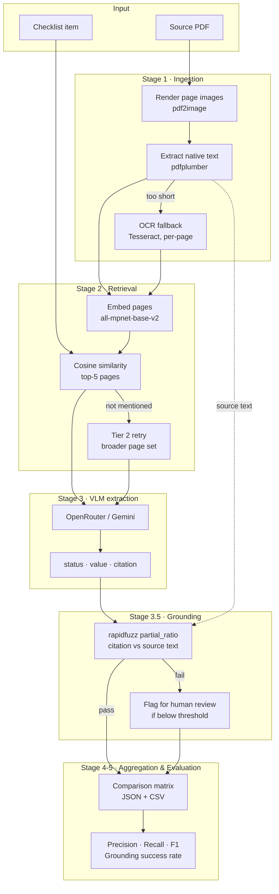

# Multimodal Document Audit Engine

Checks whether a source document satisfies each item on a checklist — with a supporting citation, and a separate step that verifies the citation is real before the result is trusted.

Demonstrated here on public SEC 10-K filings against a sample audit checklist. The pipeline is domain-agnostic: the same design applies to contract review, procurement comparisons, or any "does this document satisfy this checklist item" task.

> A citation from the model is not automatically trusted. It's checked against the source document with a deterministic string match — not another model call — before the result is shown as reliable.

See [ARCHITECTURE.md](./ARCHITECTURE.md) for the full design writeup: why a VLM instead of a text-only LLM, why retrieval instead of full-document context, and why grounding is a separate, non-model step.

---

## Architecture



Full walkthrough of each design decision: [ARCHITECTURE.md](./ARCHITECTURE.md)

---

## Tech stack

| Layer | Technology |
|---|---|
| **Ingestion** | `pdfplumber`, `pdf2image`, `pytesseract` (OCR fallback) |
| **Retrieval** | `sentence-transformers` (`all-mpnet-base-v2`), local embeddings, NumPy cosine similarity |
| **VLM extraction** | OpenRouter or Google Gemini, pluggable provider interface |
| **Grounding** | `rapidfuzz` (deterministic fuzzy string match, no model call) |
| **UI** | Streamlit, heavy stages run as isolated subprocesses |
| **Evaluation** | scikit-learn-style precision/recall/F1, custom grounding-rate metric |
| **Language** | Python 3.12 |

---

## Prerequisites

- Python 3.12 (pyarrow's allocator has known instability on 3.14 as of this writing)
- An API key for one VLM provider:
  - OpenRouter (`OPENROUTER_API_KEY`), or
  - Google Gemini (`GEMINI_API_KEY`)
- `poppler` and `tesseract` binaries on `PATH` (`brew install poppler tesseract` on macOS)

---

## Quick start

```bash
git clone https://github.com/Hasitha-03/audit_engine.git
cd audit_engine
python3.12 -m venv venv
source venv/bin/activate
pip install -r requirements.txt
```

```bash
export OPENROUTER_API_KEY='sk-or-...'
# or
export GEMINI_API_KEY='AIzaSy...'
```

**Run the UI:**

```bash
streamlit run app.py
```

Upload a checklist (`data/scope_matrix.json` sample included) and one or more filings from `data/sample_files/`, then prepare a run and query a line item.

**Or run the batch CLI:**

```bash
python run_pipeline.py \
    data/scope_matrix.json \
    AAPL_10K="data/contractors/AAPL_10K/manifest.json" \
    --out-dir data/results \
    --provider gemini
```

---

## Pipeline stages

| Stage | Script | What it does |
|---|---|---|
| 0 | `src/stage0_scope_ingestion.py` | Parses the checklist into structured ground-truth items |
| 1 | `src/stage1_pdf_ingestion.py` | Renders pages to images, extracts text (native + OCR fallback) |
| 2 | `src/stage2_semantic_retrieval.py` | Embeds pages, retrieves top-k candidates per checklist item |
| 3 | `src/stage3_vlm_orchestrator.py` | Sends candidate pages to the VLM, parses structured output |
| 3.5 | `src/stage3_5_grounding_verification.py` | Fuzzy-matches citations against source text |
| 4 | `src/stage4_aggregation.py` | Merges results into a comparison matrix (JSON + CSV) |
| 5 | `src/stage5_metrics_evaluation.py` | Computes precision, recall, F1, grounding success rate |

---

## Example result

A real query against a public SEC 10-K, checked against a requirement to identify operating lease commitments and total future minimum lease payments:

| Field | Value |
|---|---|
| Status | INCLUDED |
| Extracted figure | 7,714 |
| Citation page | 80 |
| Section | Cash paid for amounts included in the measurement of lease liabilities |
| **Grounding score** | **100.0** |

A grounding score of 100.0 means the citation genuinely exists, verbatim, on the cited page — verified independently of the model that produced it. See [ARCHITECTURE.md](./ARCHITECTURE.md#why-grounding-is-a-separate-non-model-step) for what this score does and doesn't guarantee.

---

## Known limitations

- Grounding verifies a citation is real; it doesn't verify the model read the right figure out of a multi-column table.
- The model's self-reported confidence label isn't independently checked.
- Retrieval can miss the correct page if a checklist item is phrased very differently from the source document.

Full discussion: [ARCHITECTURE.md](./ARCHITECTURE.md#known-limitations)

---

## What's next

- Gate the VLM call on OCR confidence, so clean pages skip the VLM entirely and only ambiguous pages escalate to it.
- Combine keyword search with the current embedding-only retrieval, decided per query by a model rather than a fixed strategy.

## License

MIT
